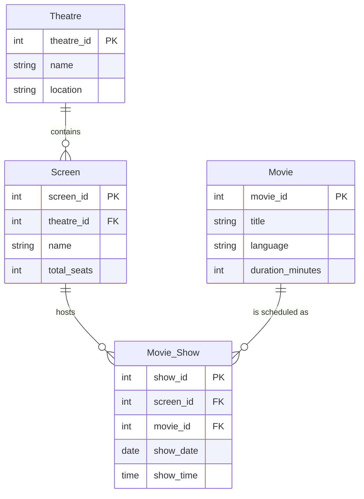

# BookMyShow - Database Architecture and Solution
_Powered by Groq LLM_

## 1. Entity-Relationship Architecture

Based on the problem statement, we require entities that can accurately represent theatres, the screens inside them, the movies, and the specific schedule for when a movie plays.

### Entities & Attributes
1. **Theatre**: Stores theatre details.
   - `theatre_id` (PK): Unique identifier.
   - `name`: Name of the theatre.
   - `location`: Area/City location.
2. **Movie**: Stores movie information.
   - `movie_id` (PK): Unique identifier.
   - `title`: Name of the movie.
   - `language`: Language of the movie.
   - `duration_minutes`: Runtime in minutes.
3. **Screen**: Represents physical screens inside a theatre.
   - `screen_id` (PK): Unique identifier.
   - `theatre_id` (FK): Theatre to which this screen belongs.
   - `name`: Screen name (e.g., Audi 1).
   - `total_seats`: Seating capacity.
4. **Movie_Show**: Represents a specific screening of a movie.
   - `show_id` (PK): Unique identifier.
   - `screen_id` (FK): The screen where the movie is playing.
   - `movie_id` (FK): The movie being played.
   - `show_date`: Date of the show.
   - `show_time`: Start time of the show.

### ER Diagram



## 2. Normalization Analysis (1NF to BCNF)
The schema strictly complies with normalization rules up to BCNF:
- **1NF (First Normal Form)**: All table columns are atomic, meaning each cell holds a single, indivisible value. There are no repeating groups or arrays.
- **2NF (Second Normal Form)**: The schema is in 1NF, and all non-key attributes are fully functionally dependent on the primary key. Since all tables use a single-column surrogate primary key (`theatre_id`, `movie_id`, `screen_id`, `show_id`), partial dependencies are impossible.
- **3NF (Third Normal Form)**: The schema is in 2NF, and there are no transitive dependencies. All non-key attributes depend strictly and directly on the primary key, and not on other non-key attributes.
- **BCNF (Boyce-Codd Normal Form)**: For every non-trivial functional dependency $X \rightarrow Y$, $X$ is a superkey. In our schema, the only determinants are the primary keys, which inherently are superkeys. Thus, it satisfies BCNF.

---

## 3. SQL Queries (P1 Solution)

### Table Creation Queries
These queries can be directly executed on a MySQL database.

```sql
CREATE DATABASE IF NOT EXISTS bookmyshow_db;
USE bookmyshow_db;

CREATE TABLE Theatre (
    theatre_id INT PRIMARY KEY AUTO_INCREMENT,
    name VARCHAR(255) NOT NULL,
    location VARCHAR(255) NOT NULL
);

CREATE TABLE Movie (
    movie_id INT PRIMARY KEY AUTO_INCREMENT,
    title VARCHAR(255) NOT NULL,
    language VARCHAR(50) NOT NULL,
    duration_minutes INT NOT NULL
);

CREATE TABLE Screen (
    screen_id INT PRIMARY KEY AUTO_INCREMENT,
    theatre_id INT NOT NULL,
    name VARCHAR(50) NOT NULL,
    total_seats INT NOT NULL,
    FOREIGN KEY (theatre_id) REFERENCES Theatre(theatre_id) ON DELETE CASCADE
);

CREATE TABLE Movie_Show (
    show_id INT PRIMARY KEY AUTO_INCREMENT,
    screen_id INT NOT NULL,
    movie_id INT NOT NULL,
    show_date DATE NOT NULL,
    show_time TIME NOT NULL,
    FOREIGN KEY (screen_id) REFERENCES Screen(screen_id) ON DELETE CASCADE,
    FOREIGN KEY (movie_id) REFERENCES Movie(movie_id) ON DELETE CASCADE
);
```

### Sample Data Insertion
```sql
-- Insert Theatres
INSERT INTO Theatre (name, location) VALUES 
('PVR Cinemas', 'Phoenix Mall, Mumbai'),
('INOX', 'Nariman Point, Mumbai');

-- Insert Movies
INSERT INTO Movie (title, language, duration_minutes) VALUES 
('Inception', 'English', 148),
('Interstellar', 'English', 169);

-- Insert Screens
INSERT INTO Screen (theatre_id, name, total_seats) VALUES 
(1, 'Audi 1', 150),
(1, 'Audi 2', 200),
(2, 'Screen A', 100);

-- Insert Shows
INSERT INTO Movie_Show (screen_id, movie_id, show_date, show_time) VALUES 
(1, 1, '2026-10-15', '09:00:00'),
(1, 2, '2026-10-15', '13:00:00'),
(2, 1, '2026-10-15', '10:30:00'),
(3, 2, '2026-10-16', '18:00:00');
```

### Example Rows

**Table: Theatre**
| theatre_id | name | location |
|---|---|---|
| 1 | PVR Cinemas | Phoenix Mall, Mumbai |
| 2 | INOX | Nariman Point, Mumbai |

**Table: Movie_Show**
| show_id | screen_id | movie_id | show_date | show_time |
|---|---|---|---|---|
| 1 | 1 | 1 | 2026-10-15 | 09:00:00 |
| 2 | 1 | 2 | 2026-10-15 | 13:00:00 |

---

## 4. Query to List Shows (P2 Solution)

**Requirement**: Write a query to list down all the shows on a given date at a given theatre along with their respective show timings.

```sql
SELECT 
    m.title AS movie_title,
    m.language,
    s.show_time,
    sc.name AS screen_name
FROM 
    Theatre t
JOIN 
    Screen sc ON t.theatre_id = sc.theatre_id
JOIN 
    Movie_Show s ON sc.screen_id = s.screen_id
JOIN 
    Movie m ON s.movie_id = m.movie_id
WHERE 
    t.name = 'PVR Cinemas'          -- Filter by theatre name
    AND s.show_date = '2026-10-15'  -- Filter by the given date
ORDER BY 
    s.show_time ASC;
```
